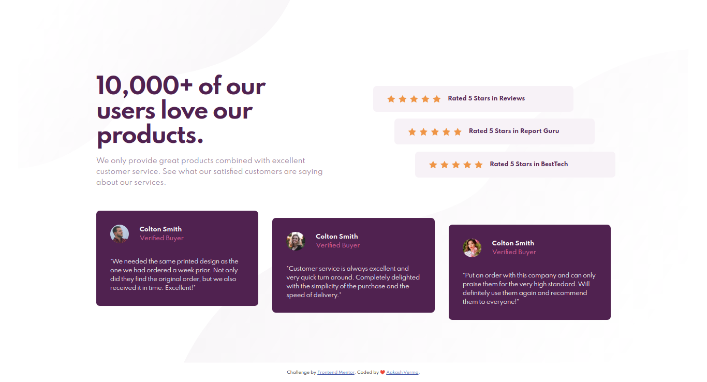

# Frontend Mentor - Social proof section solution

This is a solution to the [Social proof section challenge on Frontend Mentor](https://www.frontendmentor.io/challenges/social-proof-section-6e0qTv_bA). Frontend Mentor challenges help you improve your coding skills by building realistic projects. 

## Table of contents

- [Overview](#overview)
  - [The challenge](#the-challenge)
  - [Screenshot](#screenshot)
  - [Links](#links)
- [My process](#my-process)
  - [Built with](#built-with)
  - [What I learned](#what-i-learned)
  - [Continued development](#continued-development)
- [Author](#author)


## Overview

### The challenge

The challenge was tough for me because I am learning web development. I made this design for 375px 1440px 1366px screens.
- View the optimal layout for the section depending on their device's screen size

### Screenshot




### Links

- Solution URL: [Github](https://github.com/skyv26/social-proof-design)
- Live Site URL: [Netlify Live](https://social-proof-4.netlify.app/)

## My process

### Built with

- Semantic HTML5 markup
- CSS custom properties
- Flexbox
- CSS Grid
- Mobile-first workflow

### What I learned

Use this section to recap over some of your major learnings while working through this project. Writing these out and providing code samples of areas you want to highlight is a great way to reinforce your own knowledge.

To see how you can add code snippets, see below:

```html
<h1>Some HTML code I'm proud of</h1>
```
```css
.proud-of-this-css {
  color: papayawhip;
}
```
```js
const proudOfThisFunc = () => {
  console.log('🎉')
}
```

### Continued development

I am working on flex grid concepts in order to get quality result.

## Author

- LinkedIn - [Aakash Verma](https://www.linkedin.com/in/devaakash/)
- Frontend Mentor - [@skyv26](https://www.frontendmentor.io/profile/skyv26)
- Github - [@skyv26](https://github.com/skyv26)